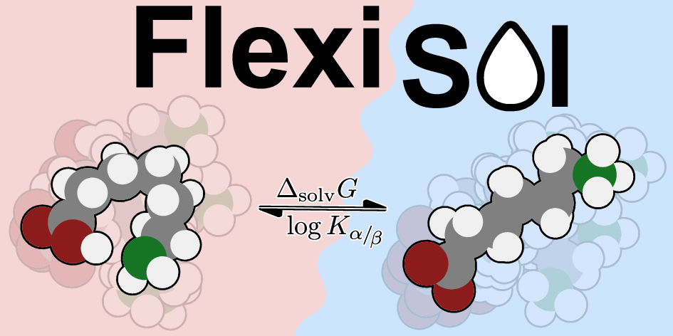

# Lightweight FlexiSol Analyzer
[](https://github.com/grimme-lab/flexisol/blob/main/LICENSE.txt)
[](https://github.com/grimme-lab/flexisol/releases/latest)
[](https://doi.org/XX.XXX/XXXX)

<p align="center">
  
</p>
Lightweight evaluation tool for FlexiSol – a flexible solvation benchmark set with molecule ensembles. FlexiSol is the
first of its kind to combine structurally and functionally complex, highly flexible solutes with exhaus-
tive conformational sampling for systematic testing of solvation models.

## Project Structure

```
repo/
├─ flexisol/               # Benchmark data (structures, per-method folders)
├─ data/
│  ├─ raw_energies/        # CSV with energies for `populate`
│  ├─ references/          # Experimental references (CSV)
│  └─ results/             # Published example results (small)
├─ output/                 # Generated CSVs from evaluations
├─ flexisol_eval/          # Package: CLI and helpers
│  ├─ cli.py               # Console entrypoint (`flexisol`)
│  ├─ reader.py            # I/O + weighting (Boltzmann/minimum)
│  ├─ evaluation.py        # gsolv/pkab assembly vs references
│  ├─ metrics.py           # Error metrics, outlier filtering
│  ├─ config.py            # Defaults and runtime config
│  └─ registry.json        # Method registry (column → folder, type)
├─ pyproject.toml
└─ README.md
```

- Energy files under each method folder are named `el_energy` or `solv_energy`.
- Avoid committing large outputs; keep `output/` small and reproducible.

## Install
- Create a fresh Conda env (recommended):
  - `conda create -n flexisol python=3.10 -y`
  - `conda activate flexisol`
- Install from the repo root:
  - Editable (dev): `pip install -e .`
  - Regular: `pip install .`
- Verify installation:
  - `flexisol --help`  (or `python -m flexisol_eval.cli --help`)

## Usage
General syntax is: `flexisol <command> [options]` (e.g., `flexisol evaluate-all -h`).

There are two main commands: `evaluate-all` and `evaluate-one` for analyzing multiple or single methods. The `populate` command copies energies from a CSV into the expected folder structure.

### Quickstart
- Populate and evaluate all methods using the provided data folders:
  - `flexisol populate --csv data/raw_energies/energies.csv --root flexisol`
  - `flexisol evaluate-all --root flexisol -w boltzmann -g full`
- Find mode-specific help with `-h` on any command, e.g.:
  - `flexisol evaluate-all -h`
  - `flexisol evaluate-one -h`
  - `flexisol populate -h` 

### Prepare data
- Populate from CSV (writes el_energy/solv_energy):
  - `flexisol populate --csv data/raw_energies/energies.csv --root flexisol`

### Batch analysis
- Evaluate all baselines (writes CSVs to `output/`, prints stats):
  - `flexisol evaluate-all --root flexisol -w boltzmann -g full`
- Options for stats filtering (legacy-like):
  - `--sigma 3` (default), `--no-sigma`, `--abs-cutoff 200` (default), `--no-abs-cutoff`.

### Weighting & Geometry
- Weighting (`-w`, `--weighting`): controls how conformer energies are aggregated per group.
  - `boltzmann` (default): Boltzmann-weighted average over conformers (298.15 K).
  - `minimum`: Selects the minimum energy across conformers.
- Geometry (`-g`, `--geometry`): chooses which geometry to use when evaluating.
  - `full` (default): Use gas-phase geometry for gas mode and solvated geometry for solv mode.
  - `gas`: Use gas-phase geometry for both modes (duplicates gas rows to solv).
  - `solv`: Use solvated geometry for both modes (duplicates solv rows to gas).

Examples:
- Minimum weighting with solv geometry: `flexisol evaluate-all --root flexisol -w minimum -g solv`
- Gas geometry only: `flexisol evaluate-one --root flexisol -ee el_r2scan-3c -se smd -g gas`

### Sample Output
Below is a sample run of `flexisol evaluate-all` with Boltzmann weighting and full geometry. It shows the header (tool, version, authors), progress steps with timings, result path and row counts, and per-datapoint statistics.

```
   +------------------------------------+
   |         FlexiSol Evaluator         |
   |              v 0.1.0               |
   | Authors: L. Wittmann, C. E. Selzer |
   +------------------------------------+

Working on el_r2scan-3c [weighting=boltzmann, geometry=full]
  reading structures       ... done (0.20 sec)
  reading energies         ... done (17.71 sec)
  weighting (boltzmann)    ... done (1.25 sec)
  evaluating gsolv         ... done (1.82 sec)
  evaluating pkab          ... done (1.03 sec)
  results written to /home/wittmann/Documents/projects/p02_solvl/paperscript/evaluator/output/el_r2scan-3c-full-boltzmann-results.csv
  results: 824 rows (gsolv=530, pkab=294)  (total 22.37 sec)

  statistics for gsolv (kcal/mol) (abs>200, 3-sigma):
    method                         ME      MAE     RMSE       SD     AMAX      N
    ------------------------ -------- -------- -------- -------- -------- ------
    alpb                        -0.54     2.79     3.54     3.50    10.31    526
    smd                          0.71     2.50     3.27     3.19    10.09    529
    ...

  statistics for pkab (log units) (abs>200, 3-sigma):
    method                         ME      MAE     RMSE       SD     AMAX      N
    ------------------------ -------- -------- -------- -------- -------- ------
    alpb                         1.71     2.47     3.11     2.59     9.25    290
    smd                         -0.09     1.06     1.41     1.41     4.57    291
    ...
```

- Progress: each step shows wall time to help spot bottlenecks.
- Results: path and row counts; counts per datapoint (gsolv, pkab) are printed.
- For statistics, see "Error metrics" below.

### Single method analysis
- Example (r2scan-3c + SMD, full + Boltzmann):
  - `flexisol evaluate-one --root flexisol -ee el_r2scan-3c -se smd -w boltzmann -g full`
- Always writes a CSV to `output/<ee>-<geometry>-<weighting>-<se>-results.csv` and prints per-datapoint stats (gsolv, pkab) with N.

### Adding a new method
- Edit `flexisol_eval/registry.json` (no code changes needed)
- Compute your new method (electronic energy or solvation energy) for all structures.
  - Include the energies either in the `flexisol/` folder directly (`el_energy` or `solv_energy`), or
  - Place them in `data/raw_energies/energies.csv` and run `flexisol populate` to copy them over.

## Error metrics
The following error metrics are computed by default:
- Mean Error (ME) (also called Mean Signed Error, MSE)
- Mean Absolute Error (MAE)
- Root Mean Square Error (RMSE)
- Standard Deviation (SD) 
- Maximum Absolute Error (AMAX)
- Count (N) of datapoints after filtering.

## Outlier filtering
Two types of outlier filtering are applied by default:
1. Absolute cutoff: removes datapoints with absolute reference value > 200 (kcal/mol for gsolv, log units for pkab). This is not needed but included for legacy reasons.
2. Sigma-clipping: removes datapoints with absolute error > 3 standard deviations from the mean error.
